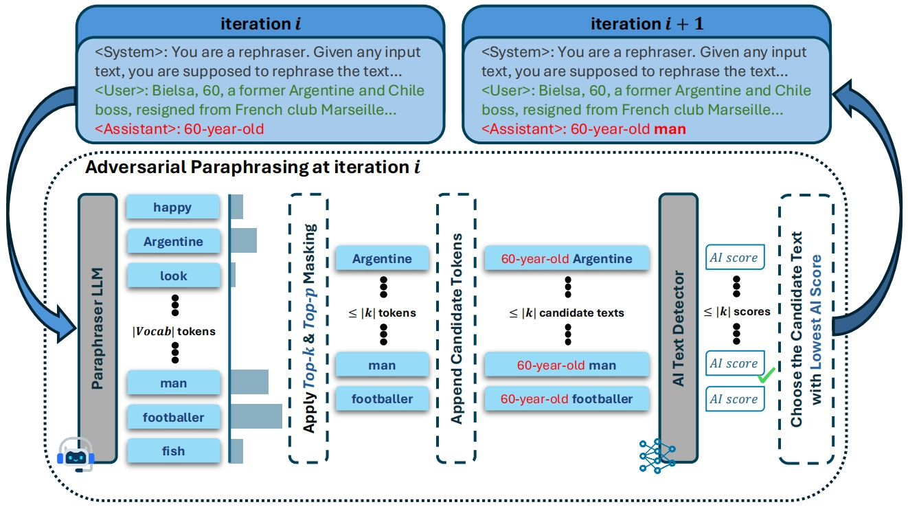
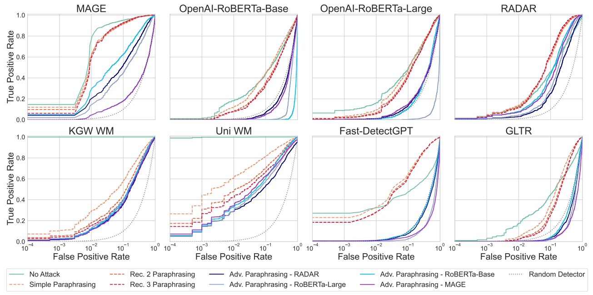

# Adversarial Paraphrasing: A Universal Attack for Humanizing AI-Generated Text

This repository contains the official implementation of **Adversarial Paraphrasing**, introduced in the paper:  
📄 [_Adversarial Paraphrasing: A Universal Attack for Humanizing AI-Generated Text_](https://arxiv.org/abs/xxxx)

Adversarial Paraphrasing is a universal, training-free attack that humanizes AI-generated text to evade a wide variety of AI text detectors.


## 🧠 Overview
Adversarial paraphrasing is a training-free attack framework that universally humanizes any AI-generated text to evade detection more effectively. Our approach leverages an off-the-shelf instruction-following LLM to paraphrase AI-generated content under the guidance of an AI text detector, producing adversarial examples that are specifically optimized to bypass detection.



> **Key Insight**: Most, if not all, high-performing detectors tend to converge toward a common distribution that characterizes human-authored text. Consequently, if a paraphraser is guided to evade detection by a well-trained detector, its outputs will naturally align more closely with this shared, human-like distribution. As a result, the generated text becomes more difficult to detect—not only by the detector used for guidance, but also by others, since all are ideally calibrated to the same underlying distribution of human-written text.

Ours experiments show that our attack is both broadly effective and highly transferable across several detection systems.



For questions or feedback, please email [Yize Cheng](mailto:yzcheng@cs.umd.edu) and [Vinu Sankar Sadasivan](mailto:vinu@cs.umd.edu).


## 📁 Repository Structure
- `utils.py`: Core implementation of the Adversarial Paraphrasing algorithm.

- `quality_judge_utils.py`: Prompt templates for GPT-4o quality evaluation.

- `outputs/`: Saved outputs of simple and adversarially paraphrased texts, as well as detection scores on human texts that were used for plotting the ROC curve.

- `scripts/`: Scripts for running paraphrasing, detection, and dataset creation.

- `kgw_wm/wm_mage`, `uni_wm/wm_mage`: Watermarked datasets (KGW and Unigram).

- Implementation of detectors used in the paper.

- `parseNsave_paraphrased_output.py`: Parses and saves paraphrased outputs into HuggingFace dataset format.

## ⚙️ Installation
We recommend creating a separate virtual or conda environment with python>=3.10, and then run:
```bash
pip install -r requirements.txt
```


## 📦 Watermarked Datasets
We covered two types of watermarks in our experiments:
- **[KGW](https://arxiv.org/abs/2301.10226)**
- **[Unigram](https://arxiv.org/abs/2306.17439)**

The watermarked datasets are available under `kgw_wm/wm_mage/` and `uni_wm/wm_mage/` respectively (in HuggingFace format).

To recreate them:

```bash
# SLURM
sbatch scripts/create_wm_mage.sbatch

# or local CUDA
bash scripts/create_wm_mage.sbatch
```

> Customize the `wm_name` variable in the script to either `kgw_wm` or `uni_wm`.

## 🚀 Running Adversarial Paraphrasing

To run adversarial paraphrasing on original AI texts:
```bash
# SLURM
sbatch scripts/transfer_test.sbatch

# or local CUDA
bash scripts/transfer_test.sbatch > path_to_log_file.log
```
**Parameters to customize:**
- `dataset`: Input dataset (must match detector type, e.g. watermarked).
- `guidance_classifier`: Detector used to guide paraphrasing.
- `deploy_classifier`: Detector used to evaluate paraphrased outputs.
- `adversarial=1`: Enables adversarial paraphrasing.  
  Set to `0` for regular paraphrasing (guidance classifier is ignored in this case).

> When run with SLURM, outputs are saved in SLURM logs. In local environments, redirect output to a file to capture results.

The results include both the input and output texts, along with their detection scores. Lower scores indicate more 'human-like' content, while higher scores suggest more 'AI-generated' content.


## 🔁 Testing Other Detectors on Existing Outputs

Once you've generated adversarially paraphrased outputs, you can evaluate them using different detectors without re-paraphrasing:

1. **Extract the paraphrased outputs:**

   Edit and run:
   ```bash
   python parseNsave_paraphrased_output.py
   ```

2. **Run additional detectors on these outputs:**
   ```bash
   # SLURM
   sbatch scripts/detect_existing_paraphrased_text.sbatch

   # or local CUDA
   bash scripts/detect_existing_paraphrased_text.sbatch
   ```


## 🌟 Text Quality Evaluation (with GPT-4o)

We provide utilities to evaluate the quality of the paraphrased texts using GPT-4o.

1. Set your `OPENAI_API_KEY` as an environment variable.
2. Load saved texts in any way you prefer and pass them to the functions in `quality_judge_utils.py`.
3. The included prompt templates follow our experimental design for consistent quality evaluation.

## citation

If you find our work useful, please consider citing us via:

```bibtex

```
